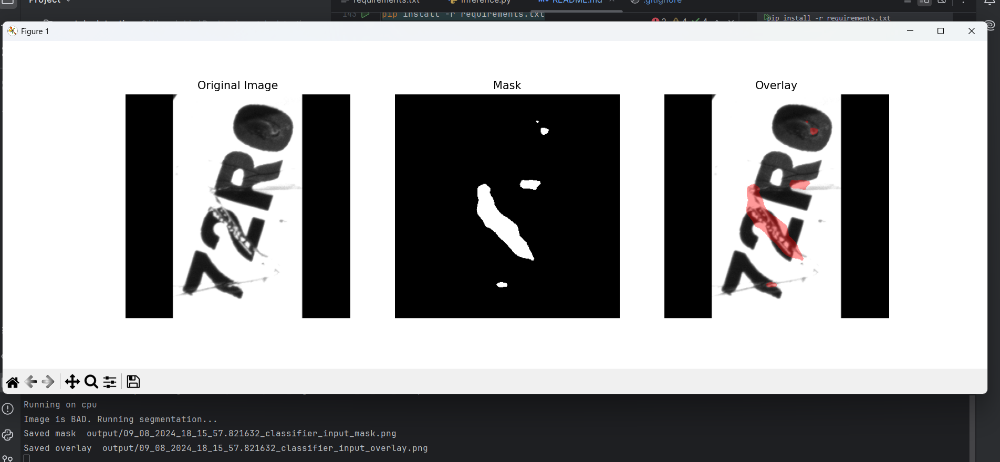

# 🔍 Scratch Detection Pipeline

[](https://www.python.org/downloads/)
[](https://pytorch.org/)

A complete two-stage deep learning pipeline for detecting scratches on text in images using state-of-the-art architectures.

## 🎯 Overview

This pipeline combines **classification** and **segmentation** for robust scratch detection:

1. **Stage 1: Classification** (ConvNeXt-Tiny)  
   Quickly determines whether an image contains scratches (`GOOD` or `BAD`)

2. **Stage 2: Segmentation** (U-Net + EfficientNet-B5)  
   For images classified as `BAD`, generates:
   - Binary scratch mask
   - Visual overlay highlighting scratch regions

## ✨ Key Features

- **Two-stage pipeline** for efficient inference
- **State-of-the-art models**: ConvNeXt-Tiny for classification, U-Net with EfficientNet-B5 encoder for segmentation
- **Automatic image preprocessing**: Handles images of any size with smart padding
- **Visual outputs**: Binary masks and color overlays
- **Easy to use**: Simple CLI interface
- **Extensible**: Easily swap in different model architectures

## 📁 Repository Structure

```
scratch_detection/
│
├── inference.py                 # Main CLI inference script
├── requirements.txt             # Python dependencies
├── README.md                    # This file
│
├── models/                     # Model weights (add your trained models here)
│   ├── classifier_convnext.pth
│   └── seg_efficientnetb5.pth
│
├── samples/                     # Sample test images (optional)
│   └── test.jpg
│
└── output/                      # Generated outputs (auto-created)
    ├── *_mask.png
    └── *_overlay.png
```

## 🚀 Quick Start

### 1. Environment Setup

Create and activate a conda environment:

```bash
conda create -n scratch_env python=3.10 -y
conda activate scratch_env
```

Install dependencies:

```bash
pip install -r requirements.txt
```

### 2. Download Model Weights

Create a directory named **`models/`** in the project root.  
Download all trained model weights from the following link:

🔗 **Google Drive (Model Weights):**  
https://drive.google.com/drive/folders/1O4WjIRykX4bhVGcIeNn0Fq3D1z5b1KEB?usp=sharing

After downloading, place the files like this:
```
models/
├── classifier_convnext.pth       # ConvNeXt-Tiny classifier (2 classes: GOOD/BAD)
└── seg_efficientnetb5.pth        # U-Net segmentation model
```

Make sure the `--classifier` and `--segmenter` CLI paths point to files inside the **models** folder:

### 3. Run Inference

```bash
python inference.py \
    --image path/to/image.jpg \
    --classifier models/classifier_convnext.pth \
    --segmenter models/seg_efficientnetb5.pth
```

#### Output

The script automatically saves:
- `output/<image_name>_mask.png` - Binary scratch mask
- `output/<image_name>_overlay.png` - Original image with highlighted scratches

It also displays a matplotlib window showing:
- Original image
- Predicted mask
- Overlay visualization

## 🧠 Pipeline Architecture

### Stage 1: Classification

| Component | Details |
|-----------|---------|
| **Model** | ConvNeXt-Tiny (timm) |
| **Input** | 224×224 RGB image |
| **Output** | Binary classification (0: GOOD, 1: BAD) |
| **Purpose** | Fast pre-filtering to avoid unnecessary segmentation |

**Logic:**
- If `GOOD` → Pipeline ends, no scratch detected
- If `BAD` → Proceed to segmentation

### Stage 2: Segmentation

| Component | Details |
|-----------|---------|
| **Model** | U-Net with EfficientNet-B5 encoder |
| **Input** | 384×384 RGB image (padded to square) |
| **Output** | Binary mask (scratch regions) |
| **Threshold** | 0.5 (adjustable) |
| **Visualization** | Red overlay on original image |

## 📦 Dependencies

```txt
torch>=2.0.0
torchvision>=0.15.0
timm>=0.9.0
segmentation-models-pytorch>=0.3.3
numpy>=1.24.0
Pillow>=10.0.0
matplotlib>=3.7.0
```

Install with:
```bash
pip install -r requirements.txt
```

## 💡 Usage Examples

### Basic Usage

```bash
python inference.py \
    --image samples/scratched_text.jpg \
    --classifier weights/classifier_convnext.pth \
    --segmenter weights/seg_efficientnetb5.pth
```

## 🎨 Output Examples

### Input Image
Original image with scratch on text

### Segmentation Output

| Mask | Overlay |
|------|---------|
| Binary mask showing scratch regions | Original image with red highlight on scratches |

## 🔧 Model Training

This repository focuses on inference. For training:

1. **Classification Training**: Use `timm` with ConvNeXt-Tiny on your labeled dataset (GOOD/BAD)
2. **Segmentation Training**: Use `segmentation_models_pytorch` with U-Net + EfficientNet-B5 encoder on pixel-annotated scratch masks

Coming soon: Full training pipeline and dataset preparation scripts!

## 📊 Performance Notes

- **Classification**: Fast pre-filtering reduces unnecessary segmentation calls
- **Segmentation**: 384×384 input provides good balance between speed and accuracy
- **Preprocessing**: Automatic padding ensures aspect ratio preservation
- **Threshold**: Default 0.5 works well; adjust based on your use case


### Adjust Segmentation Threshold

```python
mask = (pred_mask > 0.3).astype(np.uint8)  # Lower threshold = more sensitive
```

## Troubleshooting

| Issue | Solution |
|-------|----------|
| `RuntimeError: CUDA out of memory` | Reduce batch size or use CPU inference |
| `FileNotFoundError: weights/` | Ensure model weights are downloaded and placed correctly |
| Low segmentation quality | Check if image resolution is too low; retrain with better data |
| False positives | Adjust classification threshold or retrain with more diverse data |

## 📘 Training Notebooks Included

This repository includes **three Jupyter notebooks** that were used to train both the classifier and segmentation models:
- **mowito-classifier_convnext.ipynb** → ConvNeXt-Tiny classifier training

- **mowito-classifier_vit.ipynb** → ViT-Base classifier training (alternative)
- **mowito-segmentation.ipynb** → U-Net + EfficientNet-B5 segmentation training

## 📓 Training Notebooks (Kaggle)

This repository also provides the full Kaggle notebooks that were used to train the models included in this project.

### 🔷 Classification Notebooks (ConvNeXt & ViT)

Below are the notebooks used to train the **GOOD/BAD image classifier**:

- **ConvNeXt-Tiny Classifier Notebook**  
  🔗 https://www.kaggle.com/code/shivrajbhalekar2991/mowito-classifier-convnext

- **ViT Base Classifier Notebook**  
  🔗 https://www.kaggle.com/code/shivrajbhalekar2991/mowito-classifier-vit


---

### 🔶 Segmentation Notebook (U-Net + EfficientNet-B5)

The following notebook was used to train the **scratch segmentation model**:

- **U-Net Segmentation Notebook**  
  🔗 https://www.kaggle.com/code/shivrajbhalekar2991/mowito-segmentation


---

These notebooks cover the complete training process including:
- Data preprocessing  
- Augmentation strategies  
- Model training  
- Validation  
- Model export for inference  

You can open them directly in Kaggle and run the full training pipeline.

## 📊 Model Performance Comparison

The table below summarizes the results of all models used in the project.

### 🔍 Classification Models

| Model               | Test Accuracy | Precision (Bad) | Recall (Bad) | Notes |
|---------------------|--------------|-----------------|--------------|-------|
| **ViT-Base**        | 0.9903       | 0.9711          | 0.9805       | Strong global understanding, transformer-based |
| **ConvNeXt-Tiny**   | 0.9923       | 0.9714          | **0.9903**   | Best performer, strong local texture learning |

---

### 🎯 Segmentation Model

| Model                          | Precision | Recall | Notes |
|--------------------------------|-----------|--------|-------|
| **U-Net (EfficientNet-B5)**    | 0.7864    | 0.7446 | Good scratch localization, struggles on faint scratches |


## 📸 Sample Output

Below is an example showing the Original Image, Predicted Mask, and Overlay:



